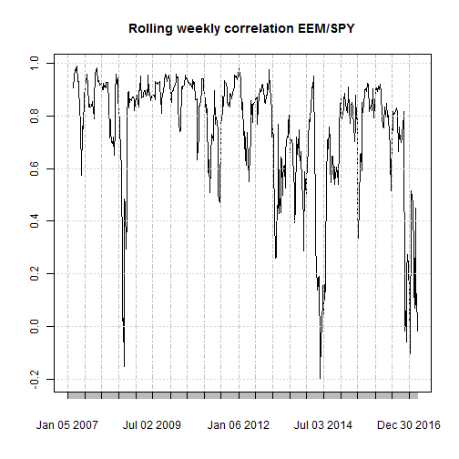

Find Correlations Between Markets
========================================================
author: TH
date: April 2, 2017
autosize: true

Background
========================================================

This application is built using shiny (https://shiny.rstudio.com/). 

It allows a user to calculate correlations between non-US markets and U.S. market. 

Markets included:
- EEM: MSCI Emerging Markets Index
- EWJ: iShares MSCI Japan ETF
- FXI: iShares FTSE/Xinhua China 25 Index ETF
- EWZ: iShares MSCI Brazil ETF

Dependency:
R library "quantmod"

How to use this app?
========================================================

- Step 1: Select an ETF from the dropdown menu
- Step 2: Select a time period
- Step 3: Select a rolling window
- Step 4: Click the `Plot` button and wait a few seconds
- Step 5: Go to `Correlation Plot` tab
- Step 6: Switch to different markets or time frames

App file structure
========================================================
Three files are used to create this app:
- server.R: shiny app back-end
- ui.R: shiny app front-end
- calculate_cor.R: a R script used to download data and calculate correlation

Example output
========================================================

